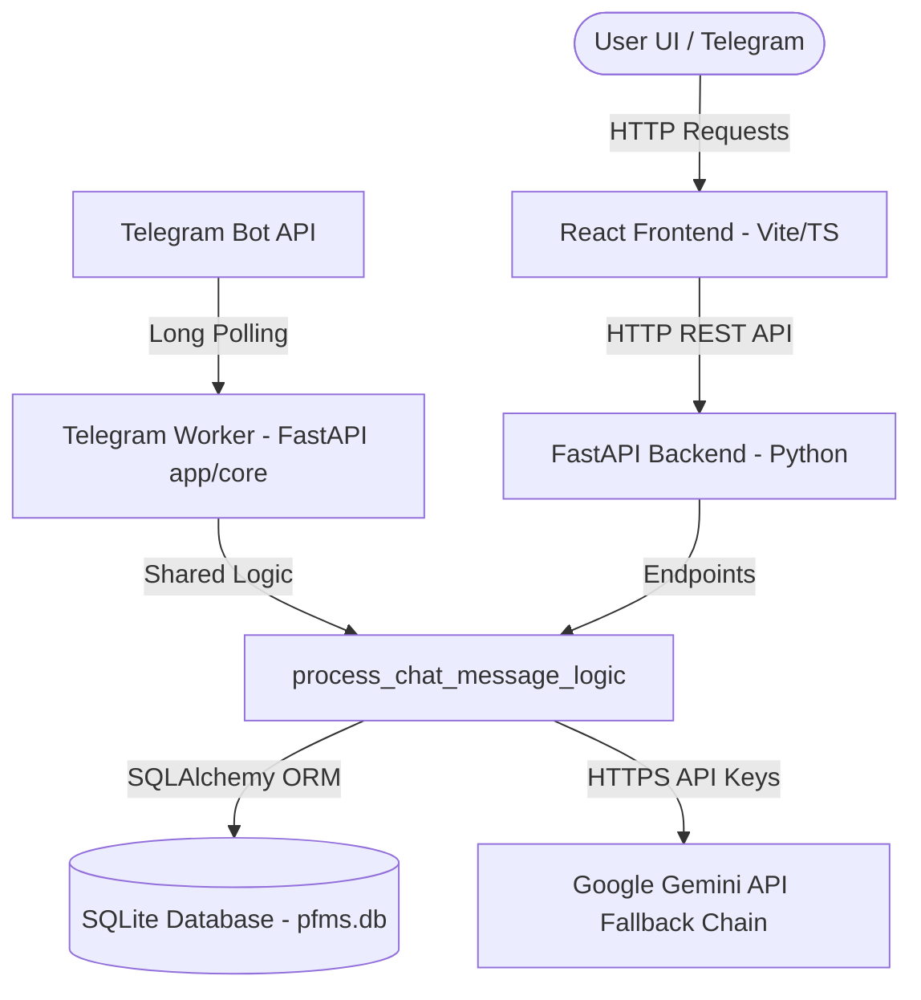

# System Documentation: Personal Finance Management System (PFMS)

This document provides a comprehensive technical overview of the Personal Finance Management System (PFMS) for architecture reviews, developer onboarding, and planning next-generation features.

---

## About the App

### Purpose & Vision
PFMS is a local-first, single-tenant personal finance tracker designed to give users complete control over their financial records (expenses, assets, liabilities, peer-to-peer friend ledgers, and credit cards) without exposing sensitive financial data to cloud hosting providers. It aims to bridge the gap between simple spreadsheets and complex enterprise software through a streamlined, premium user interface and a local/cloud hybrid AI parsing copilot.

### Architecture & Tech Stack
The application is designed using a decoupled Client-Server architecture:



* **Frontend**: Built with **React 19 (TypeScript)**, bundled via **Vite**. Styling is managed with **Tailwind CSS** for dark-mode utility classes, and transitions use **Framer Motion** for premium animations (e.g., dynamic glass orb breathing states and spring-physics metrics cards). Analytics charts are powered by **Recharts**.
* **Backend**: Powered by **FastAPI (Python)**, providing a high-performance ASGI server. It uses **SQLAlchemy 2.0** as the Object-Relational Mapper (ORM).
* **Database**: Runs on a local **SQLite** database (`pfms.db`), ensuring data is persistent, local-first, and requires zero external administration.

### User Experience (UX)
The interface is structured into five core pages:
1. **Dashboard**: Unified financial overview displaying monthly expenses, net worth (assets minus liabilities), cash reserves, credit cards outstanding, active EMIs, and a historical 6-month income vs. expense chart.
2. **Transactions**: Comprehensive paginated list of financial entries with multi-type filters.
3. **Accounts**: View/create interfaces for cash wallets, salary/savings accounts, and credit card limits.
4. **People**: Personal borrowing/lending timelines showing peer-to-peer ledgers.
5. **AI Copilot (Chat)**: A fluid conversation panel equipped with a 3D-styled animated core status orb. Users can log entries by typing natural language or read on-demand financial summary narratives.

---

## Antigravity Functions Used

The app's agentic AI pipeline ("AI Copilot") is driven by the Gemini API models (`gemini-2.5-flash`, `gemini-2.0-flash-lite`, `gemini-2.0-flash`). The core intelligence routing, logic, and wrappers include:

### 1. Unified Message Router (`process_chat_message_logic`)
Located in the backend [ai.py](file:///c:/PFMS/backend/app/routers/ai.py), this function intercepts user queries before calling external APIs and implements a three-tier priority routing pattern:
* **Priority 1: Summary Requests (Local Compilation + AI Narrative)**
  If the message requests an overview (e.g. *"Summarize my finances"*), the backend compiles current ledger metrics from SQLite (Net Worth, Bank/Cash, Friend balances, EMIs, recent 5 transactions) and injects it into a prompt template, which it sends to `generate_financial_summary`. This returns a custom, professional narrative report inline in the chat bubble.
* **Priority 2: Greetings & General Help (Instant Local Cache)**
  Greetings (e.g. *"hello"*, *"help"*) are intercepted by local keyword checkers. The server responds instantly with a static greeting menu, **bypassing the Gemini API key call** to conserve quota limits.
* **Priority 3: Natural Language Processing (LLM Intent Parsing)**
  If the query represents a transaction, the app passes it to `parse_intent(message)`. The Gemini API parses the text into a structured JSON payload mapping to one of the database schemas (`CREATE_EXPENSE`, `CREATE_LOAN`, `CREATE_PAYMENT`, `CREATE_EMI`, etc.).

### 2. Multi-Model Fallback Engine (`parse_intent` & `generate_financial_summary`)
Defined in [gemini.py](file:///c:/PFMS/backend/app/core/gemini.py), the client uses an HTTP client to communicate with Gemini. To avoid downtime due to rate limits or API service overloads (`503 Service Unavailable` / `429 Too Many Requests`), it uses a fallback model chain:
```python
models_to_try = [GEMINI_MODEL, "gemini-2.5-flash", "gemini-2.0-flash-lite", "gemini-2.0-flash"]
```
If the primary model fails or returns a non-200 code, the engine sequentially tries alternative operational models, logging exceptions gracefully.

### 3. Telegram Update Offset Synchronization
In [telegram_worker.py](file:///c:/PFMS/backend/app/core/telegram_worker.py), the background bot handles requests through long polling. To prevent rate limits when Uvicorn restarts, it polls once on startup with `offset=-1`. This clears all pending old updates from Telegram's server queue, ensuring that only messages sent *after* the bot was initialized are passed to the Gemini parser.

---

## Current Features

### 1. Double-Entry Core Engine & Account Balances
* Account balances and contact ledgers are computed dynamically from transaction tables, preserving auditing trails.
* Supports **Double-Entry Transactions** for transfers (e.g. Transfer, Credit Card Payments) which correctly debit the source account and credit the target account.

### 2. Automatic Processing Fee Logic
* Includes transaction logic that monitors transactions (like credit card payments or wallet additions). When `apply_processing_fee` is checked, the backend automatically generates a child transaction representing a 2% fee, logging it as an `Expense` category under *Processing Charges*.

### 3. Peer-to-Peer Friend Ledgers
* The People page tracks outstanding lent/borrowed amounts on a per-contact basis. The backend computes the net position (Net Position = Outstanding Lent − Outstanding Borrowed) and displays a detailed, scrollable transaction timeline.

### 4. EMI Schedule Tracker
* Allows users to register recurring EMIs, including metadata like interest rates, start/end dates, monthly due days, and payment states.

### 5. On-Demand Narrative Summary
* The dashboard and AI chat load statistical numbers locally without calling Gemini. Users generate the expensive AI summary only when clicking the manual Refresh button, saving Gemini API Free Tier token quota.
